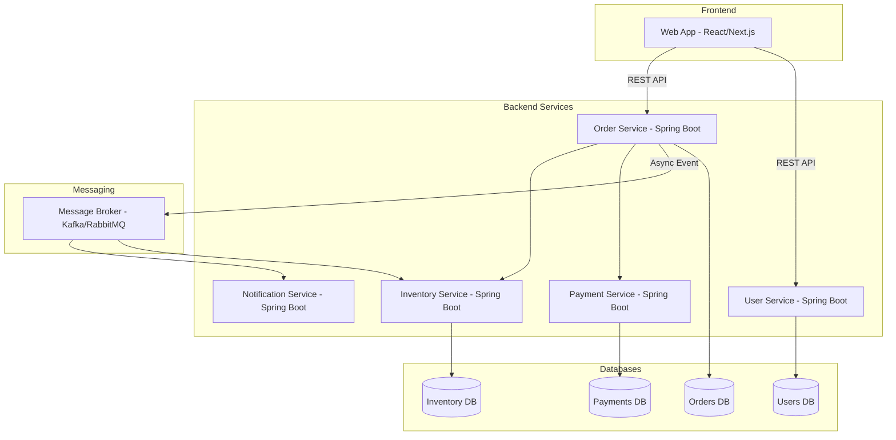
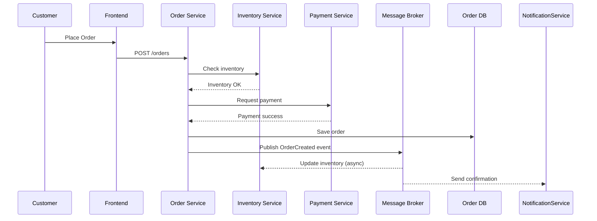
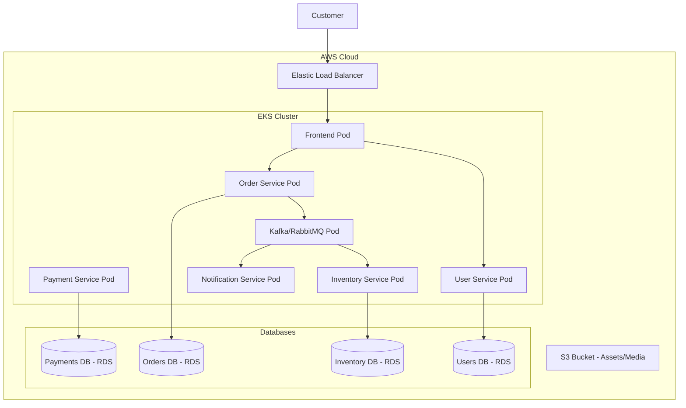
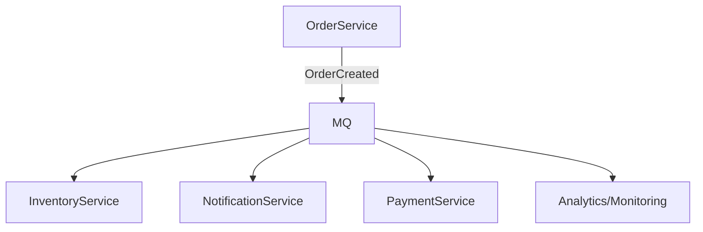

# 🛒 Microservice E-Commerce Project

This project is a **microservice-based e-commerce application** designed to learn and practice:

* **Backend Development** with **Java Spring Boot**
* **DevOps** practices with **Docker, Kubernetes, Terraform, CI/CD**
* **Cloud Deployment** on **AWS** (EKS, RDS, S3, Load Balancer)
* **Event-Driven Architectures** using **Kafka/RabbitMQ**

---

## 🚀 Goals

* Build a **realistic e-commerce app** using microservices.
* Learn **containerization & orchestration** with Docker & Kubernetes.
* Explore **cloud deployment** with AWS and Infrastructure as Code.
* Practice **CI/CD pipelines** and modern DevOps workflows.

---

## 🗂️ System Architecture

High-level overview of the system:

---

## 📦 Order Workflow – Sequence Diagram

How an order is placed and processed:

---

## ☁️ Deployment Architecture

Containerized deployment with **Kubernetes on AWS EKS**:

---

## 🔄 Event/Data Flow

Asynchronous communication with **event-driven architecture**:

---

## 🛠️ Tech Stack

* **Backend:** Java 17, Spring Boot, Maven
* **Frontend:** React/Next.js
* **Databases:** PostgreSQL/MySQL (via AWS RDS)
* **Messaging:** Kafka / RabbitMQ
* **Infrastructure:** Docker, Kubernetes (EKS), Terraform
* **CI/CD:** GitHub Actions / Jenkins
* **Cloud Services:** AWS RDS, S3, EKS, ELB

